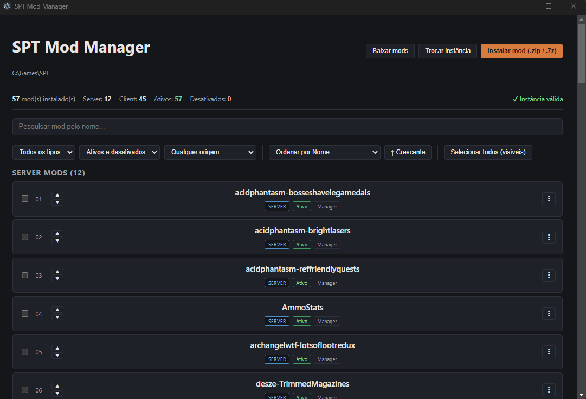
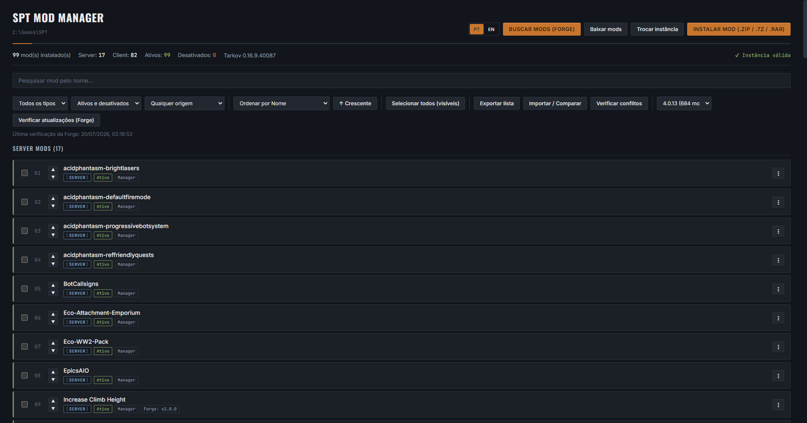

# SPT Mod Manager

🇧🇷 Leia em Português: [README_pt-BR.md](README_pt-BR.md)

A **Vortex / Mod Organizer 2**-style mod manager, built specifically for **Single Player Tarkov (SPT)**.

A desktop app (Electron + React + TypeScript) that handles installing, organizing, enabling/disabling, and removing mods without manually messing with folders — while staying compatible with mods you already installed by hand.

Styled with its own "tactical manifest" look — condensed headers, monospace technical data, a warm accent color — rather than a generic dark-mode template.

> ⚠️ Personal project, not affiliated with the SPT team or Battlestate Games. Tarkov and Escape from Tarkov are trademarks of their respective owners. ⚠️

---

## Features

**Installation**
- Install mods from `.zip`, `.7z`, or `.rar`, via file picker or drag-and-drop straight into the window
- Automatic structure detection — works even when the mod is wrapped in extra folders (e.g. `SPT/user/mods/ModName/...`)
- Type detection: Server, Client, or Hybrid (when the mod has both parts)
- Post-install verification: checks file by file that everything was copied correctly before reporting success

**Organization**
- Enable/disable mods without deleting anything (moves between an active folder and a `.disabled` one)
- Reorder server mod load order (up/down buttons, using numeric folder prefixes — that's how SPT respects load order)
- Rename a mod's display name (alias) without touching any real file or folder
- Detects manually installed mods (outside the app) and distinguishes them from "installed by the Manager"
- Export the current mod list to a JSON file, and import a previous export to compare it against what's currently installed (shows what's missing / extra — it doesn't reinstall anything automatically, since the app doesn't keep the original archives)
- "Hybrid" mods installed via merge that leave loose files with no folder of their own still show up as an "Orphan" row, tracked through a manifest — removable cleanly even without a named folder

**Reliability**
- Conflict detection: duplicate DLL names across different client mods, and server mods declaring the same `name` in different folders
- Automatic SPT version detection (read from the instance's `core.json`), shown in the summary — on SPT 4.0+ installs, `core.json` no longer stores the SPT version itself, so it falls back to showing the compatible Tarkov version instead
- Checks your installed mods against [Forge](https://forge.sp-tarkov.com)'s public API for updates, with a per-mod inline status chip: update available, update blocked by a dependency conflict, incompatible with your SPT version, or — for mods with no locally-readable version (e.g. `.dll`-only mods with no `package.json`) — the latest version Forge knows about
- Search/browse the Forge catalogue from inside the app (by name, category, and optionally filtered to your selected SPT version) and install a mod in one click — it downloads the chosen version and runs it through the same installer as a manually picked archive
- SPT version picker pulled straight from Forge's own version list (with a mod count per version) instead of free text
- Bilingual UI (Portuguese/English), with a PT/EN toggle in the corner — including error/confirmation messages
- Never lists or touches SPT's own core client files (e.g. `BepInEx/plugins/spt/spt-core.dll`) as if they were a mod, even under "select all + remove"
- If an installed archive's structure isn't recognized (no DLL, no `package.json`, no `user`/`BepInEx` folder), shows a confirmation dialog with the archive's root contents instead of silently failing or guessing
- A newly installed mod gets checked against Forge right away, without re-querying every other mod you'd already checked
- Check results and the "last checked" timestamp persist across restarts

**Finding what you need**
- Real-time search by name
- Filters by type, status (enabled/disabled), and origin (manual/Manager)
- Sort by name, type, status, origin, or install date
- Multi-select with bulk actions (enable/disable/remove several at once), including Shift+Click for range selection

**Interface**
- Cards showing type, status, origin, and — when available — mod version and author
- Per-mod action menu: enable/disable, open folder, rename, reinstall, remove (orphan entries only show rename/remove, since they don't have a folder of their own to enable or open)
- Instance summary in the header (total mods, breakdown by type, enabled/disabled, detected SPT version)
- Temporary success/error notifications

---

## Screenshots





---

## Getting Started

### Prerequisites
- [Node.js](https://nodejs.org/) 18 or later
- Windows (the app assumes Windows-style SPT folder conventions; not tested on Linux/macOS)
- An existing SPT instance installed somewhere on your PC

### Development

```bash
git clone https://github.com/YOUR_USERNAME/spt-mod-manager.git
cd spt-mod-manager
npm install
npm run electron:dev
```

This builds the renderer (Vite) + the main process (`tsc`) and opens the Electron window.

If you just want to work on the UI without opening Electron (faster to iterate on CSS/layout):
```bash
npm run dev
```
In this mode `window.modManagerAPI` doesn't exist, so anything depending on the backend will fail — it's just for visuals.

### Building the installer (Windows)

```bash
npm run electron:build
```
Generates a `.exe` via `electron-builder` (configuration already set in `package.json`).

---

## Project structure

```
spt-mod-manager/
├── electron/
│   ├── main.ts         # Electron window + IPC handlers
│   ├── preload.ts       # exposes window.modManagerAPI to the renderer (contextIsolation)
│   ├── modManager.ts    # all the filesystem logic (scan, install, enable, etc)
│   └── types.ts         # shared types on the Electron side
├── src/
│   ├── App.tsx           # the whole React UI
│   ├── App.css           # styles
│   ├── main.tsx           # React entry point
│   └── types.ts           # types + interface for the API exposed by preload
├── package.json
└── vite.config.ts
```

---

## How it works under the hood

### Folder conventions used
| What | Where |
|---|---|
| Active server mods | `<instance>/user/mods/` |
| Disabled server mods | `<instance>/user/mods.disabled/` |
| Active client mods | `<instance>/BepInEx/plugins/` |
| Disabled client mods | `<instance>/BepInEx/plugins.disabled/` |

### Load order
SPT loads server mods in alphabetical order. The app controls this by prefixing the mod's folder with a 2-digit number (`01_modname`, `02_othermod`, ...), which gets updated whenever you use the reorder buttons.

### Control files (at the instance root)
- `.spt-mod-manager-registry.json` — tracks which mods were installed by the app (to tell them apart from "manually installed")
- `.spt-mod-manager-aliases.json` — custom display names (renaming doesn't touch any real file)

### "Smart" installation
When installing a `.zip`/`.7z`/`.rar`, the app searches recursively (not just at the archive's root) for a folder containing `user/` and/or `BepInEx/` — this covers both "ready to copy" mods and mods wrapped in an extra folder. If that structure isn't found, it tries to identify whether it's a server mod (via `package.json`) or a client mod (via `.dll`) and installs it in the right place.

### Forge integration
The app talks to [Forge](https://forge.sp-tarkov.com)'s public API (`forge.sp-tarkov.com/api/v0`) — the SPT team's own official mod platform. It's read-only, needs no API key, and is rate-limited generously (40 requests/10s burst, 200/60s sustained); the app respects this with a small delay between requests when checking many mods at once.

Since the app only tracks a mod's *name* locally (not a Forge ID), matching against Forge's catalog is done by name — using the mod's real, folder-derived name rather than a display alias, so renaming a mod for your own organization never breaks the match. This is a heuristic, and can occasionally miss a mod with a very generic name or one that isn't listed on Forge.

Worth knowing: starting with SPT 4.0, server mods no longer declare their version in `package.json` (that convention moved to a metadata class inside the mod's own code) — so plenty of installed mods simply have no locally-readable version to compare against. For those, the app still looks them up on Forge and shows the latest known version as information, without claiming an update is "available" (since there's nothing local to compare it to).

---

## Known limitations

- **"Hybrid" mods installed via merge** show up as an "Orphan" row tracked through a manifest, but only support rename/remove — no enable/disable as a unit, since there's no folder of their own to move.
- **"Reinstall"** in the action menu opens the generic file picker (it doesn't keep the original `.zip`/`.7z`/`.rar`) — works well for updating a mod to a new version, but isn't a true one-click "reinstall this exact thing."
- **Conflict detection is file-level**, not semantic — it flags duplicate DLLs and duplicate server mod names, but has no idea whether two mods actually touch the same thing in-game.
- **Forge matching for update-checking is name-based**, not by a stable ID — a very generic mod name, or a mod not listed on Forge, won't be found (the new search/browse tab doesn't have this problem, since it talks to Forge's catalogue directly by ID).
- **Forge search filtering by SPT version filters the mod, not each version** — the API applies `filter[spt_version]` at the mod level, so the version dropdown for a matching mod can still include versions built for other SPT releases; check the SPT constraint shown next to each version before installing.
- Only tested on Windows.

---

## Roadmap

Done (moved up into Features ⬆️):
- [x] Conflict detection between mods (file-level)
- [x] Automatic SPT version detection in the header summary
- [x] Install manifest for hybrid mods (they show up in the list and can be removed cleanly)
- [x] Update checking against Forge, with per-mod inline status and a version picker sourced from Forge itself
- [x] Full mod search/browse/one-click install from Forge

Still open:
- [ ] A real one-click "reinstall", remembering the original `.zip`/`.7z`/`.rar` instead of reopening the generic file picker
- [ ] Deeper conflict detection (e.g. two mods editing the same loot table), not just duplicate file names
- [ ] Zip-slip hardening on archive extraction (defense in depth, since mod files come from third parties)
- [ ] Linux/macOS support

---

## Contributing

Personal project, but issues and PRs are welcome. If you're planning something big, open an issue first to align on it.

## License

[MIT](LICENSE)

`.rar` extraction is powered by [node-unrar-js](https://github.com/YuJianrong/node-unrar.js), a WASM build of the official UnRAR source, which is free to use but distributed under its own license (not MIT) — see the package's `LICENSE.md` for details.