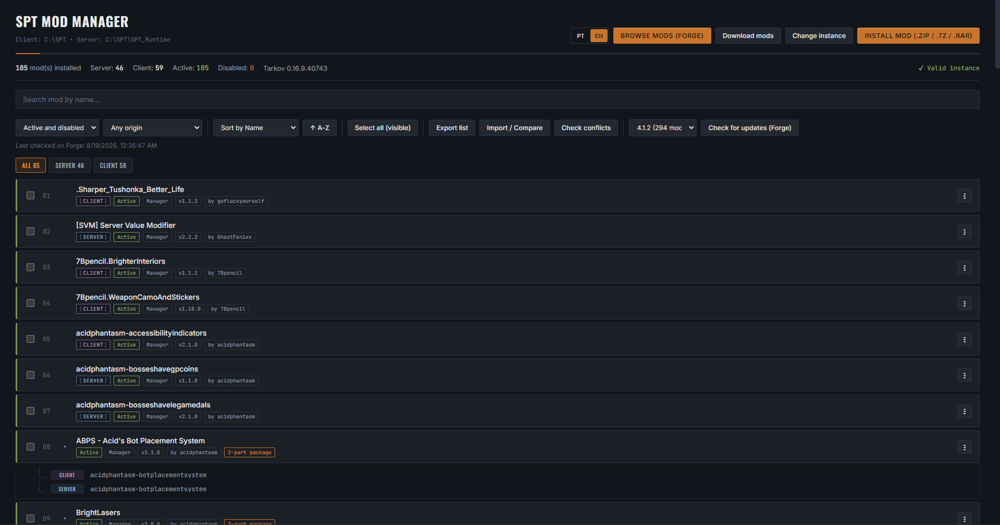
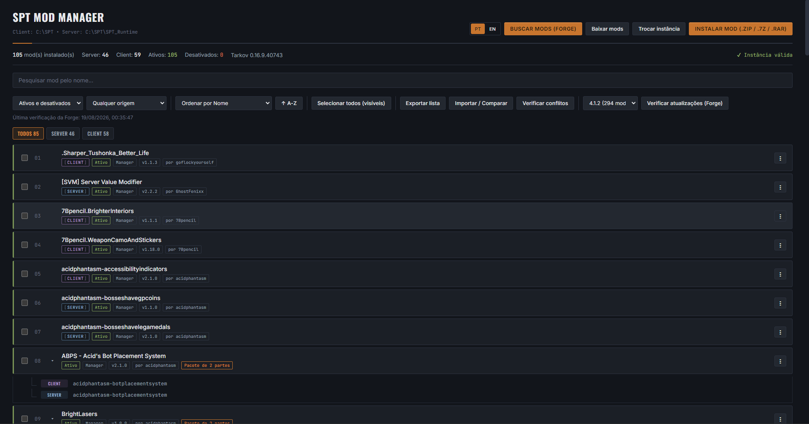

# SPT Mod Manager

[](https://github.com/Nevek20/SPT_Mod_Manager/releases/latest)
[](https://github.com/Nevek20/SPT_Mod_Manager/releases)
[](LICENSE)

🇺🇸 Read in English: [README.md](README.md)

Um gerenciador de mods no estilo do **Vortex** e do **Mod Organizer 2**, feito especificamente pro **SPT**.

Instale, atualize, ative, desative e remova mods sem ficar mexendo em pasta. Navegue pelo catálogo e instale com um clique, com as dependências vindo junto. Mods que você já instalou na mão continuam funcionando e aparecem na lista como qualquer outro.

> ⚠️ Projeto pessoal, sem vínculo com a equipe do SPT nem com a Battlestate Games. Tarkov e Escape from Tarkov são marcas de seus respectivos donos.



---

## Download

**[Baixe o instalador mais recente em Releases](https://github.com/Nevek20/SPT_Mod_Manager/releases/latest)** (`SPT-Mod-Manager-x.x.x-win-x64.exe`), ou pela [página do mod no sp-mod.com](https://sp-mod.com/mod/2851/spt-mod-manager).

1. Rode o instalador.
2. O SmartScreen do Windows pode avisar que o app não é reconhecido, porque o instalador não tem assinatura digital. Clique em **Mais informações → Executar assim mesmo**.
3. Abra o app e aponte pra pasta do SPT. Ele acha a instância sozinho, inclusive quando o client e o server ficam em pastas diferentes.

O app também verifica se saiu versão nova dele mesmo, então você não precisa voltar aqui pra conferir.

**Requisitos:** Windows 10 ou 11 (x64) e um SPT já instalado. Linux e macOS ainda não têm suporte oficial.

---

## Funcionalidades

### Navegar e instalar
- Busque no catálogo de dentro do app, por nome ou categoria, ordenando por downloads, atualizados recentemente, adicionados recentemente ou nome.
- Filtre pelos mods compatíveis com a sua versão do SPT e escolha qual versão do mod instalar.
- Um clique baixa e instala. Download grande vai direto pro disco, com progresso, porcentagem e velocidade na fila de downloads.
- Instale seus próprios `.zip`, `.7z` ou `.rar` pelo seletor de arquivo ou arrastando pra janela.
- Arquivos com estrutura estranha (pasta embrulhando tudo, arquivo solto do lado da `user/`) são tratados. Se o app não reconhece o arquivo, ele mostra o conteúdo e pergunta, em vez de chutar.



### Dependências
- Antes de instalar, o app pergunta pra fonte do que o mod precisa e compara com o que você tem.
- Dependência faltando ou desatualizada aparece na lista com o tamanho, e **Instalar todos** baixa elas primeiro e o mod depois.
- Nos resultados da busca, um selo marca os mods que precisam de algo que você não tem.
- Mod de várias partes (server + client) é tratado como um pacote só: ativar, desativar ou remover uma parte leva as outras junto.

### Atualizações
- **Verificar atualizações** compara cada mod instalado com a fonte e coloca um chip de status em cada linha: atualização disponível, bloqueada ou incompatível com a sua versão do SPT.
- **Atualizar todos** instala tudo na ordem das dependências. Quando o mod A precisa da versão nova do mod B, o B vai primeiro.
- Atualizar mantém o que você tinha: mod desativado continua desativado, e se a versão nova mudou o nome da pasta, a antiga é removida em vez de ficar lá carregando duas vezes.

### Organizar
- Ative e desative sem apagar nada.
- A lista em árvore junta as partes de um mod numa linha só, com filtros por tipo, status e origem, e ordenação por nome, tipo, status, origem ou data de instalação.
- Renomeie como um mod aparece sem mexer em nenhum arquivo de verdade.
- Selecione vários mods (Shift+Clique pra um intervalo) e ative, desative ou remova de uma vez.
- Abra a pasta do mod (qualquer uma das metades, em mod de server + client) ou a página dele na fonte.

### Listas de mods
- Exporte sua lista de mods pra um arquivo e importe em outro PC ou numa instalação nova.
- Na importação, o app compara com o que está instalado, baixa as versões exatas que faltam e oferece desativar o que sobra.

### Segurança
- Os arquivos do próprio SPT (como o `spt-core.dll`) nunca aparecem nem são mexidos como se fossem mod, e um mod que traga a própria cópia não sobrescreve a sua.
- O conteúdo dos arquivos é conferido antes de extrair, então nada consegue escrever fora da pasta do SPT.
- Toda instalação é verificada arquivo por arquivo antes de dizer que deu certo.
- Verificação de conflito: aponta DLL duplicada entre mods de client e mods de server declarando o mesmo nome.

### Idiomas
English, Português, 中文, Русский, Français, 日本語 e Deutsch, escolhido pelo idioma do sistema na primeira vez que abre.

---

## Achou um bug?

Quando algo dá errado, o erro vem com um botão **Detalhes**. Ele abre uma caixa com:

- **Copiar erro**: o erro junto com a versão do app, do SPT e do Windows, que é exatamente o que precisa pra investigar. O seu nome de usuário do Windows é tirado de qualquer caminho.
- **Abrir issue no GitHub**: abre uma issue nova com tudo isso já preenchido.

Você também pode mandar nos comentários da [página no sp-mod.com](https://sp-mod.com/mod/2851/spt-mod-manager).

---

## Como funciona

### Onde os mods ficam
| O quê | Onde |
|---|---|
| Mods de server ativos | `<SPT>/user/mods/` |
| Mods de server desativados | `<SPT>/user/mods.disabled/` |
| Mods de client ativos | `<SPT>/BepInEx/plugins/` |
| Mods de client desativados | `<SPT>/BepInEx/plugins.disabled/` |

### Fontes de mods
O catálogo vem do [sp-mod.com](https://sp-mod.com) por padrão, com a [Forge Alt](https://forge-alt.katrinfoxvr.com) como segunda opção. As duas usam a mesma API e os mesmos IDs de mod, então trocar de uma pra outra não perde nada. O app só lê delas e não precisa de conta nem de chave de API.

### Como o app reconhece mods instalados
Mods do SPT 4.x declaram um ID (`com.autor.mod`), uma versão e as dependências dentro do DLL, e o app lê de lá. É esse ID que liga o mod no disco ao catálogo, e a maioria dos mods se resolve numa única requisição em lote. Quem não tem ID cai na busca por nome, e todo resultado é conferido de novo, porque casar errado é pior que não casar. Depois de achado, o ID do catálogo fica guardado, e as próximas checagens levam segundos.

Pra mods instalados pelo app, vale a versão que a fonte informou na instalação, não a do DLL: tem autor que esquece de subir o número dentro do DLL, e isso faria o aviso de atualização aparecer pra sempre.

### Ordem de carregamento
Mods do SPT 4.x cuidam da própria ordem de carregamento, então o app não renomeia pasta nem força ordem nenhuma. Pastas antigas com prefixo numérico (`01_nomedomod`) continuam sendo lidas e ordenadas certo.

### Arquivos que o app guarda na pasta do SPT
- `.spt-mod-manager-registry.json`: quais mods o app instalou e o que a fonte disse sobre eles
- `.spt-mod-manager-aliases.json`: os nomes de exibição que você escolheu
- `.spt-mod-manager-manifest.json`: arquivos soltos que um mod trouxe fora da própria pasta, pra saírem junto com ele
- `.spt-mod-manager-forge-match.json`: IDs do catálogo guardados, pra checagem de atualização ser rápida

---

## Limitações conhecidas

- **A detecção de conflito é por arquivo.** Pega DLL duplicado e nome de mod de server repetido, mas não sabe se dois mods mexem na mesma coisa dentro do jogo.
- **Dois mods podem fixar versões diferentes da mesma biblioteca.** Só cabe uma cópia no disco, então vale a última instalada. O diálogo de dependências mostra quais outros mods usam a biblioteca antes de você atualizar.
- **Reinstalar pede o arquivo de novo.** Guardar todo arquivo baixado dobraria o espaço dos seus mods (um mod de 3 GB ocuparia 6 GB).
- **Mods que não estão no catálogo** podem ser instalados e gerenciados, mas não dá pra checar atualização deles.
- **Só Windows**, por enquanto.

---

## Desenvolvimento

Precisa do [Node.js](https://nodejs.org/) 18 ou mais novo.

```bash
git clone https://github.com/Nevek20/SPT_Mod_Manager.git
cd SPT_Mod_Manager
npm install
npm run electron:dev     # compila e abre o app
npm test                 # roda os testes
npm run electron:build   # gera o instalador do Windows em release/
```

`npm run dev` abre só a interface no navegador, bom pra mexer em CSS, mas nada que dependa do backend funciona ali.

### Estrutura do projeto
```
electron/
  main.ts          janela, handlers de IPC, configurações
  preload.ts       expõe window.modManagerAPI pra interface
  modManager.ts    tudo que mexe em disco ou na rede
  sources.ts       fontes de mods (sp-mod.com, Forge Alt)
  peVersion.ts     lê a versão do SPT do SPT.Server.exe
src/
  App.tsx          a interface
  modTree.ts       agrupa as partes dos mods na lista em árvore
  i18n.ts          os 7 dicionários
  reportError.ts   monta o relato de erro
tests/             um arquivo por área (npm test roda todos)
scripts/           scripts de investigação avulsos
```

### Testes
Cada arquivo em `tests/` cobre uma área, e a maioria trabalha em pastas temporárias de verdade. O `npm version` roda a suíte inteira antes e se recusa a subir a versão se algo falhar.

---

## Contribuindo

Issues e PRs são bem-vindos. Pra algo grande, abra uma issue antes pra gente alinhar o caminho.

**Traduções são especialmente bem-vindas.** Copie um dicionário existente em `src/i18n.ts`, adicione o código no tipo `Lang` e no `LANG_LABELS`, e rode:

```bash
npx tsx tests/checkTranslations.ts
```

Ele compara cada chave com o inglês e pega o que a revisão manual costuma deixar passar, tipo um marcador como `{name}` renomeado ou esquecido, que faria o app mostrar o `{name}` literal em vez do nome do mod.

---

## Créditos

As traduções pra chinês, russo, francês, japonês e alemão foram feitas pelo **[GΛVRIEL](https://github.com/GAVRIEL-911)**, que montou uma edição multilíngue do Manager por conta própria e ofereceu de volta pro projeto. Português e inglês são mantidos aqui.

Valeu a todo mundo que reporta bug e sugere coisa nos comentários. Boa parte do que está neste README existe porque alguém pediu.

## Licença

[MIT](LICENSE)

A extração de `.rar` usa o [node-unrar-js](https://github.com/YuJianrong/node-unrar.js), um build em WASM do código oficial do UnRAR, que tem licença própria (não é MIT). Veja o `LICENSE.md` do pacote.